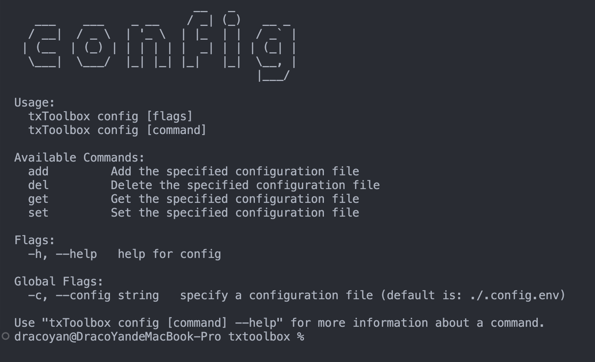
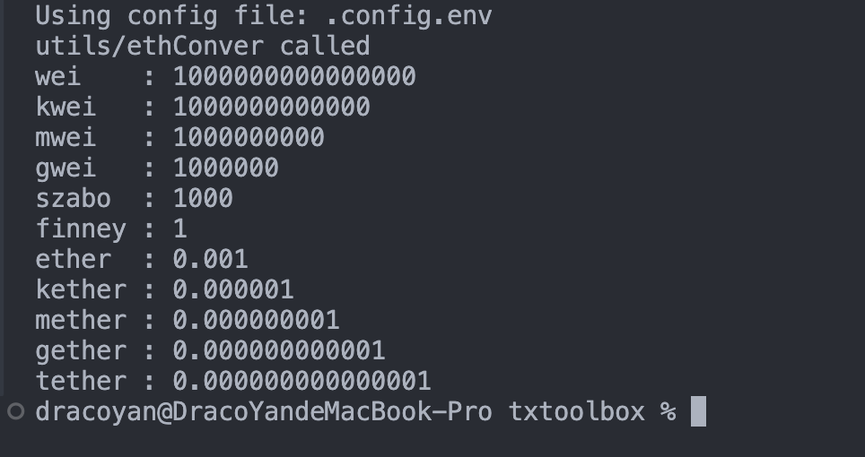
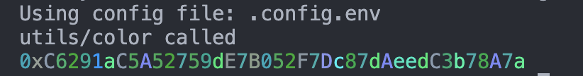
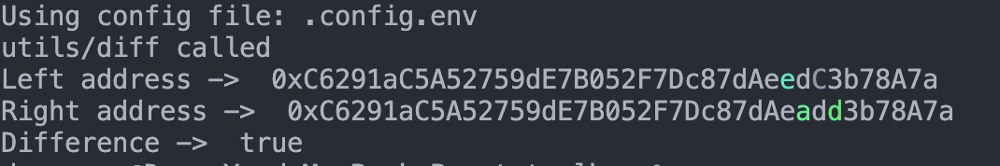
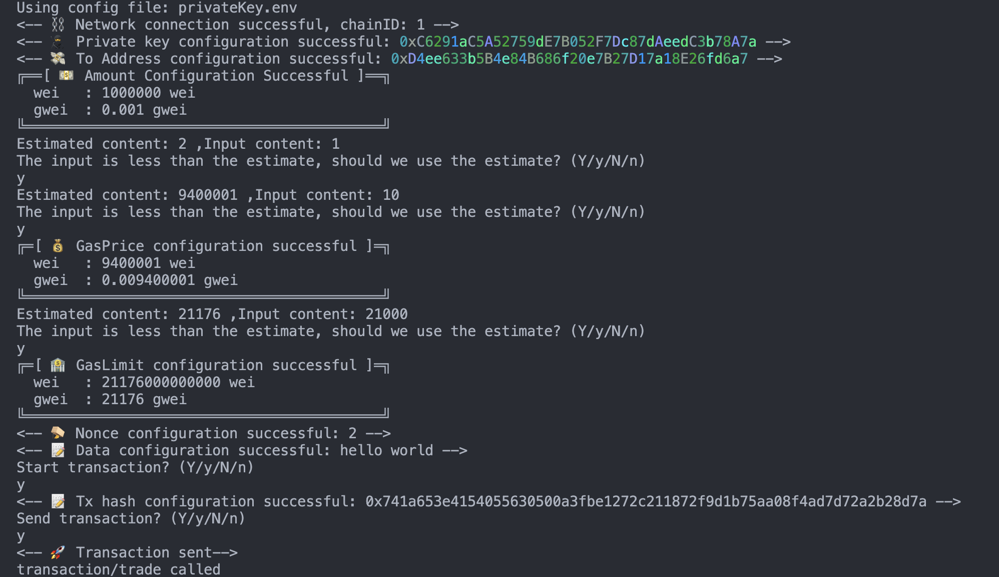

# Tx-Toolbox
Tx-Toolbox is a Go-based CLI tool for blockchain developers, offering utilities like unit conversion, vanity address creation, address marking, difference checking, transaction sending, and contract calls. It streamlines on-chain tasks, making blockchain interactions faster and more efficient.
## What is the function
### config
The config function includes adding configuration, modifying configuration, deleting configuration and viewing configuration. The content in the configuration file will be used to initiate transactions on the chain. When sensitive information is written in your own local file, security can be improved.

## utils
Utils functions include unit conversion on etherrum, adding unique colors to addresses, and checking the difference between two addresses. Unit conversion is referenced from: https://converter.murkin.me/, and is functionally consistent with it. The unique color of addresses and address difference check functions are to prevent hackers from calculating similar addresses to trick users into transferring money.
### Ethereum Converter

### Check Address
#### Address color 

#### Check address diff

## Send transaction
The transaction method supports initiating transactions directly on the chain through the configuration in the configuration file. It also adds gas and nonce checks to prevent setting errors. It also points out that when transferring money, the unit is increased, and there is no need to enter more 0
### Transaction


```
Support -c to specify the configuration file

netWork=Required
privateKey=Required
to=Required
amount=Not required(Default is 0)
amountUint=Not required
data=Not required
gasprice=Not required
gaslimit=Not required
nonce=Not required
```
Example
```
netWork=https://xxxx
privateKey=0xxxxxx
to=0xxxxxx
amount=0.001
amountUint=gwei
data=hello world
gasprice=10
gaslimit=21000
nonce=1
```


